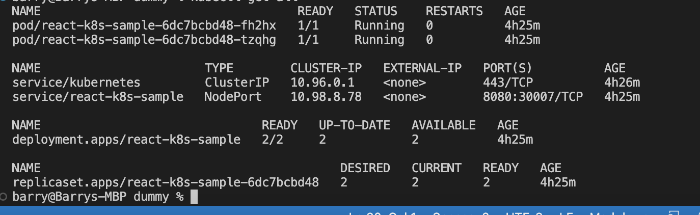
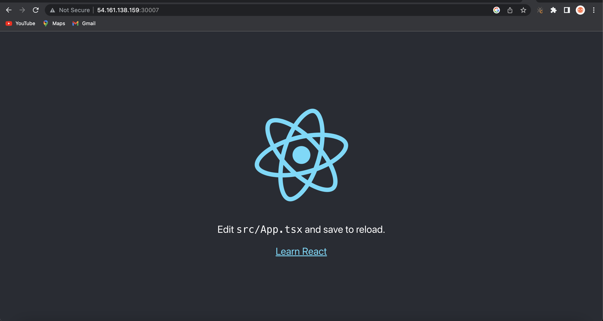

#  Kubernetes on Cloud (Azure/AWS) from scratch using Minikube and manage Docker Container in K8s using Pods, Deployment, Services and Ingress manifest files.

##  Tools: 🔧 
1. Azure Public Cloud. ✔ 
2. Docker. ✔ 
3. Minikube. ✔ 
4. K8s Manifest Files. ✔ 

##  Work Flow:
+ Create an Azure/AWS VM/instance using an Ubuntu OS image with the following specification in order to run minikube efficiently.

      2 CPUs or more
      2GB of free memory
      20GB of free disk space
+ After successful creation, SSH into the instance with the command

      ssh -i <key-name> <user>@<public-ip-address> #replace with propoer value
+ Install Docker on the VM/instance from the [documentation](https://docs.docker.com/engine/install/ubuntu/)
+ Also install kubernetes on the server from the [docs.](https://kubernetes.io/docs/tasks/tools/install-kubectl-linux/)
+ Final installation on the server is to install minikube itself from it [docs.](https://minikube.sigs.k8s.io/docs/start/) and start the minikube with docker as its driver

      minikube start --driver=docker
+ Clone the repository on the server with the command

      git clone https://github.com/sadebare/dummy.git
+ Navigate into the cloned repository and deploy the kubernetes manifest file which contains Deployment, Services and Ingress configuration

      cd k8s
      kubectl apply -f .
+ We can then get all information about what is deployed on the cluster by running the command

      kubectl get all

+ We can then access the running pod by using a port forward in our server running kubernetes

      kubectl port-forward --address 0.0.0.0 svc/react-k8s-sample 30007:8080
+ Finally we get to access the application from the internet with

      http://<public-ip-address>:<nodeport>
